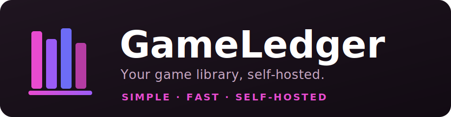

<div align="center">



<p>
  <b>The dead-simple, self-hosted library and download portal for your game collection.</b><br>
  Point it at a folder, hit scan, and browse your games in a beautiful web UI — like a media server, but for games.
</p>

[](LICENSE)
[](../../releases)
[](../../pkgs/container/gameshelve-api)
[](https://vuejs.org)
[](https://nodejs.org)
[](#-contributing)

<sub><a href="#-get-running-in-2-minutes">Get started</a> · <a href="#-features">Features</a> · <a href="#%EF%B8%8F-configuration">Configuration</a> · <a href="#-local-development">Development</a> · <a href="#-license">License</a></sub>

</div>

---

## Why GameShelve?

Self-hosting your game collection shouldn't require a wiki. GameShelve is built to be **boring to run and delightful to use**:

- 🟢 **One file, one command.** A single `docker-compose.yml` and `docker compose up -d`. No database to provision, no message queue, no reverse-proxy gymnastics.
- 📦 **Prebuilt images.** Pull ready-to-run `amd64`/`arm64` images straight from the registry — no build step, works on an Unraid box or a Raspberry Pi alike.
- 🪄 **Sensible defaults.** It just works out of the box; the only thing you _must_ set is a password.
- 🎨 **Enjoyable UI** Cover art, hero pages, screenshots and full IGDB integration, not just a file listing.

> **New to self-hosting?** The [2-minute tutorial](#-get-running-in-2-minutes) below assumes nothing.

## ✨ Features

- 🔍 **Automatic scanning & matching** — drop game folders in, GameShelve finds them and matches metadata via IGDB.
- 🖼️ **A real library** — covers, hero backgrounds, screenshots and accent-coloured detail pages, plus home-page shelves (Recently Added, Most Downloaded, Newest Releases) you can reorder and toggle.
- ✍️ **Custom games** — got something IGDB doesn't know? Pick the folder, add your own art and details, and it's catalogued just like everything else.
- ⬇️ **One-click downloads** — resumable, with friendly filenames and per-game download counts.
- 📡 **Live progress** — scan and compression progress streams to your browser in real time.
- 🔒 **Comprehensive Auditing** — whatever you, the system or the scheduler does, theres a Logs page under settings that never leaves you lost

<!-- todo: could add some screenshots here -->

## 🚀 Get running in 2 minutes

#### Prerequisites

- A machine with [Docker](https://docs.docker.com/get-docker/) and Docker Compose (Docker Desktop includes both).
- A folder containing your games (a game is either a folder or a .zip file, just drop into your library folder)

#### 1. Grab the compose file and config

```bash
mkdir gameshelve && cd gameshelve
curl -O https://raw.githubusercontent.com/dev-nick421/gameshelve/main/docker-compose.yml
curl -O https://raw.githubusercontent.com/dev-nick421/gameshelve/main/.env.example
cp .env.example .env
```

#### 2. Edit `.env` — set two things

```ini
ADMIN_PASSWORD=pick-a-strong-password   # required: protects the admin area
LIBRARY_PATH=/path/to/your/games        # the folder containing your games (a game is either a folder or a .zip file)
```

#### 3. Start it

```bash
docker compose up -d
```

That's it. Open **http://localhost:8080** in your browser. (Change the port with `WEB_PORT` if 8080 is taken.)

#### First-run walkthrough

1. Click **Login** (top right) and sign in with your `ADMIN_PASSWORD`.
2. Go to **Settings → IGDB** and paste your free [IGDB API credentials](https://dev.twitch.tv/console/apps) —> needed to fetch cover art and metadata.
3. Go to **Settings → Paths**, add your library path (`/games` will be your `LIBRARY_PATH` inside the container), and save.
4. Open the **Scan** dashboard and hit **Scan Library**. Watch the progress roll in.
5. Head back to the **Library** and enjoy your collection. 🎉

> **Updating:** `docker compose pull && docker compose up -d`. Your data lives in a
> Docker volume, so it survives upgrades. Pin a version with `IMAGE_TAG=v1.0.0` in `.env`.

## ⚙️ Configuration

Everything is configured through `.env` (see [`.env.example`](.env.example)):

| Variable                                | Required | Default   | Description                                                                   |
| --------------------------------------- | :------: | --------- | ----------------------------------------------------------------------------- |
| `ADMIN_PASSWORD`                        |    ✅    | —         | Password for the admin area. The app won't start without a non-default value. |
| `LIBRARY_PATH`                          |    ✅    | `./games` | Host folder mounted as your game library.                                     |
| `WEB_PORT`                              |          | `8080`    | Host port for the web UI.                                                     |
| `IMAGE_TAG`                             |          | `latest`  | Pin a specific release, e.g. `v1.0.0`.                                        |
| `MATCH_THRESHOLD`                       |          | `0.6`     | IGDB auto-match confidence (0–1); below this, games are left _Unmatched_.     |
| `IGDB_CLIENT_ID` / `IGDB_CLIENT_SECRET` |          | —         | Optional; can also be entered in the UI after first run.                      |

The API runs only inside the Docker network — nginx in the web container proxies
`/api` and `/ws` to it, so there's no extra port to expose or secure.

## 🗺️ How it works

1. **Scan** — finds folders/zips in your library and queues them.
2. **Match** — IGDB auto-match; uncertain results become correctable _Unmatched_ games instead of bad data.
3. **Fetch** — downloads metadata, cover, background and screenshots; extracts accent colours for the hero gradient.
4. **Compress** — streams the game into `data/<name>.zip` inside its own folder; the original is removed only after success.
5. **Browse & download** — grid and detail views, with resumable downloads.

Each game lives in its own folder named from the configurable scheme (default
`<Game Name> - <Release Year> [<IGDB_ID>]`), with `data/` for the archive and
`artwork/` for images. Display names are generated at read time, so renaming the
scheme never moves a file.

## 🧑‍💻 Local development

```bash
# API → http://localhost:3000
cd api && npm install && npm run dev

# Web → http://localhost:5173 (proxies /api and /ws to the API)
cd web && npm install && npm run dev
```

Run the tests:

```bash
cd api && npm test    # API integration, scanner, IGDB seams
cd web && npm test    # Vue components + stores
```

Build the images yourself:

```bash
docker build -t gameshelve-api ./api
docker build -t gameshelve-web ./web
```

## 📦 Releases

Pushing a `vX.Y.Z` tag builds multi-arch (`amd64` + `arm64`) images, publishes
them to `ghcr.io/<owner>/gameshelve-{api,web}`, and cuts a GitHub Release.

```bash
git tag v1.0.0
git push origin v1.0.0
```

## 🙌 Contributing

Issues and pull requests are welcome. Run `npm test` in both `api/` and `web/`
before opening a PR, and keep changes focused.

## ⚖️ Legal notice

GameShelve is a tool for managing and self-hosting **your own, legitimately owned games**. It does not provide, host, or facilitate access to any copyrighted content.

**GameShelve does not condone piracy.** Distributing or downloading games you do not own or have not licensed is illegal in most jurisdictions and a violation of the rights of developers and publishers. You are solely responsible for ensuring that the content you manage with this software complies with applicable copyright law and any relevant license agreements.

## 📄 License

GameShelve is free software under the
**[GNU Affero General Public License v3.0 or later](LICENSE)**. If you run a
modified version as a network service, you must offer your users its source.
